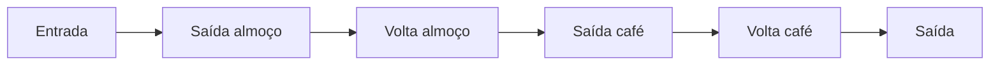

<div align="center">

# Registro de Ponto

**Sistema web de controle de jornada para a Prime Tecnologia**


[Funcionalidades](#funcionalidades) •
[Tecnologias](#tecnologias) •
[Como rodar](#como-rodar-localmente) •
[Rotas](#rotas-principais) •
[Estrutura](#estrutura-do-projeto)

</div>

---

## Sobre

O **Registro de Ponto** permite que funcionários registrem suas batidas do dia com um clique, enquanto gestores e administradores acompanham a equipe, lançam pontos manualmente e excluem registros com motivo e histórico de alterações.

---

## Funcionalidades

### Batida automática

O funcionário só clica em **Bater ponto**, e o sistema identifica sozinho qual é a próxima batida do dia:



### Papéis de usuário

| Papel | O que pode fazer |
|---|---|
| **Funcionário** | Bater ponto, consultar as próprias batidas do dia e solicitar ajustes |
| **Gestor** | Tudo do funcionário + ver a própria equipe, lançar e excluir pontos, aprovar ou rejeitar solicitações |
| **Administrador** | Tudo do gestor + ver todos os funcionários cadastrados |

### Gestão de registros

- **Solicitações de ajuste pelo funcionário**, que ficam com status **Pendente** até serem revisadas:
  - **Inclusão**: para uma batida esquecida, informando tipo, data/hora e motivo.
  - **Exclusão**: para uma batida registrada por engano, direto do painel e com o motivo. O funcionário só pode pedir a exclusão das próprias batidas.
- **Aprovação de solicitações**: gestores e administradores veem as solicitações pendentes da sua equipe e decidem:
  - **Aprovar**: a batida é incluída ou excluída automaticamente, e a alteração fica registrada no histórico.
  - **Rejeitar**: o gestor informa o motivo da rejeição.
- **Lançamento manual**: gestores registram uma batida esquecida, informando o motivo.
- **Exclusão com histórico (soft delete)**: o registro não some do banco, só é marcado como inativo.
- **Auditoria**: toda criação manual e exclusão guarda quem fez, quando e por quê.
- **Painel administrativo** do Django para gerenciar usuários, perfis e registros.

---

## Tecnologias

| Tecnologia | Uso |
|---|---|
| [Python 3.12+](https://www.python.org/) | Linguagem |
| [Django 6.1](https://www.djangoproject.com/) | Framework web |
| [PostgreSQL](https://www.postgresql.org/) | Banco de dados |
| [python-decouple](https://pypi.org/project/python-decouple/) | Variáveis de ambiente (`.env`) |
| [Pillow](https://pypi.org/project/pillow/) | Suporte a imagens |

---

## Como rodar localmente

<details>
<summary><b>Pré-requisitos</b></summary>

<br>

- Python 3.12 ou superior
- PostgreSQL instalado e rodando
- Git

</details>

**1. Clone o repositório**

```bash
git clone https://github.com/guicannoslima/registro-ponto.git
cd registro-ponto
```

**2. Crie e ative o ambiente virtual**

```bash
python -m venv venv

# Windows
venv\Scripts\activate

# Linux / macOS
source venv/bin/activate
```

**3. Instale as dependências**

```bash
pip install -r requirements.txt
```

**4. Crie o banco no PostgreSQL**

```sql
CREATE DATABASE registro_ponto;
```

**5. Crie o arquivo `.env`** na raiz do projeto, ao lado do `manage.py`

```env
SECRET_KEY=coloque-uma-chave-secreta-aqui
DB_NAME=registro_ponto
DB_USER=seu_usuario_postgres
DB_PASSWORD=sua_senha_postgres
DB_HOST=localhost
DB_PORT=5432
```

> [!TIP]
> Para gerar uma `SECRET_KEY`:
> ```bash
> python -c "from django.core.management.utils import get_random_secret_key; print(get_random_secret_key())"
> ```

**6. Aplique as migrações e crie o administrador**

```bash
python manage.py migrate
python manage.py createsuperuser
```

**7. Inicie o servidor**

```bash
python manage.py runserver
```

**8. Crie o perfil do usuário**

> [!IMPORTANT]
> Todo usuário precisa de um **Perfil** para acessar o sistema, senão o painel dá erro.
>
> 1. Acesse `http://127.0.0.1:8000/admin/` com o superusuário
> 2. Em **Perfis**, clique em **Adicionar**
> 3. Escolha o usuário, o **papel** e, se for funcionário, o **gestor** responsável

Pronto! Acesse `http://127.0.0.1:8000/` e faça login.

---

## Rotas principais

| Rota | Descrição | Acesso |
|---|---|---|
| `/login/` | Login | Todos |
| `/` | Painel do usuário | Todos |
| `/ponto/solicitar/criacao/` | Solicitar inclusão de batida | Todos |
| `/ponto/solicitar/exclusao/<id>/` | Solicitar exclusão de batida | Dono da batida |
| `/ponto/solicitacoes_pendentes/` | Solicitações pendentes da equipe | Gestor / Admin |
| `/ponto/aprovar/<id>/` | Aprovar solicitação | Gestor / Admin |
| `/ponto/rejeitar/<id>/` | Rejeitar solicitação com motivo | Gestor / Admin |
| `/equipe/` | Batidas do dia da equipe | Gestor / Admin |
| `/ponto/criar/` | Lançamento manual de ponto | Gestor / Admin |
| `/ponto/excluir/<id>/` | Exclusão de ponto com motivo | Gestor / Admin |
| `/admin/` | Painel administrativo | Superusuário |

---

## Estrutura do projeto

```
registro-ponto/
├── manage.py
├── requirements.txt
├── registro_ponto/        # configurações (settings, urls, wsgi)
└── ponto/                 # app principal
    ├── models.py          # Perfil, RegistroPonto, HistoricoAlteracaoPonto, SolicitacaoAjustePonto
    ├── views.py           # painel, bater ponto, equipe, criação/exclusão, solicitações
    ├── permissoes.py      # quem cada papel pode ver
    ├── calculos.py        # lógica da próxima batida do dia
    ├── forms.py
    ├── admin.py
    ├── urls.py
    └── templates/
```

---

## Em desenvolvimento

- [x] Solicitação de inclusão de batida pelo funcionário
- [x] Solicitação de exclusão de batida pelo funcionário
- [x] Aprovação / rejeição das solicitações pelo gestor
- [ ] Tela de histórico de alterações
- [ ] Relatórios de banco de horas

---

<div align="center">

Desenvolvido por **[Guilherme Cannos](https://github.com/guicannoslima)**

</div>
